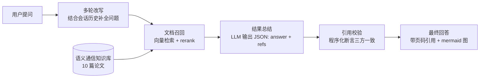
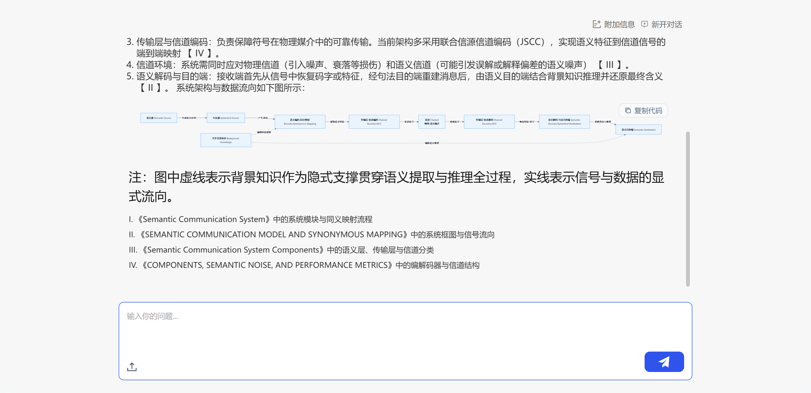

# Semantic Communication Assistant · 语义通信助手

面向语义通信领域的**文献问答智能体**：基于 10 篇核心论文构建领域知识库，
回答带**页码级引用溯源**与**程序化引用校验**，并在架构类问题上输出可渲染的 **mermaid 流程图**。

> 赛道一 · AI Agent 应用创新赛（东南大学 AI+ 创新应用大赛）
> 平台：东南大学 OpenTrek（百炼系 Agent 开发平台）

## ✨ 核心特性

- **领域知识库问答（RAG）**：10 篇语义通信核心论文全文明文解析，向量检索 + rerank；
- **引用三级校验**：正文标记 `【X】` ↔ 引用列表 `refs` ↔ 召回 chunk（含页码），
  未通过程序校验的引用会显式标注 `⚠ 引用校验：[...] 未能与本次召回内容核实`；
- **页码级溯源**：回答中的每条引用可定位到论文原文的具体页与版面位置；
- **mermaid 图表输出**：架构/流程类问题自动输出 ```` ```mermaid ```` 代码块，
  平台聊天界面原生渲染为 SVG 流程图（"文本 → 渲染图"，无需 AI 生图）；
- **双引擎形态**：确定性工作流（主推）+ 角色对话自主 Agent（AutoBotV2 / ReAct）；
- **可复现评测**：确定性 eval（4 场景断言）+ 对抗探针 + 校验节点单测；
- **全流程 API 化**：知识库灌库、Agent 发布、评测一键脚本化。

## 🏗️ 架构



**B 路线工作流（11 节点 10 边，已发布 ONLINE）**：
`开始 → 多轮改写 → 文档召回 → 召回结果处理 → 选择器 →（输出 | 总结参数 → 结果总结 → 引用校验 → 文本组合 → 内容输出）`

**A 路线自主 Agent**：AutoBotV2 + ReAct 引擎，角色化对话与自主规划；
工具已预注册（联网搜索 MCP、数学计算器等），执行器受平台沙箱限制（详见平台约束）。

## 🚀 快速开始

### 环境要求

- 东南大学校园网 / VPN（平台为内网部署：`http://10.128.203.200:30226`）；
- Python 3.10+（脚本基于标准库，无第三方依赖）。

### 配置凭据

```bash
cp .env.example .env
# 编辑 .env，填入当前浏览器登录会话的 Cookie（OPENTREK_COOKIE）
```

凭据只从环境变量 / 本地 `.env` 读取，**禁止提交真实凭据**（`.env` 已被 gitignore）。

### 运行评测

```bash
# 确定性评测：概念 / 多步 / 越界联网 / mermaid 图表，4 场景断言
python scripts/eval_agent.py

# 演示问题集：6 个问题批量问答，结果写入 demo/results/
python scripts/run_demo_qa.py

# 对抗探针：多步任务 / 联网越界等
python scripts/probe_agent.py multi-step "请先解释 Deep JSCC..."

# 校验节点单测（不依赖平台）
python scripts/test_validation_logic.py
```

### 发布新版本（clone → 补丁 → 保存 → 上线 一条龙）

```bash
python scripts/deploy_flow.py --online --name v1.7
```

平台发布纪律：ONLINE 配置冻结，每次修改必须克隆新版本后重新发布。

### 知识库灌库

```bash
python scripts/kb_upload.py <kbCode> <file1.pdf> [file2.pdf ...]
```

链路：STS 临时凭证 → minio 预签名 PUT → 注册解析。

## 📁 目录结构

```
├── docs/
│   ├── plan_book.md          # 项目策划书（对齐赛道评分点）
│   ├── technical_report.md   # 技术报告（架构 / 平台约束 / 评测）
│   ├── agent_self_review.md  # GAN 对抗自审（agent vs chatbot 判定）
│   └── RESUME.md             # 全量进度恢复文档（API / 坑 / 资产清单）
├── scripts/
│   ├── eval_agent.py         # 确定性评测（4 场景断言）
│   ├── run_demo_qa.py        # 演示问题集批量问答
│   ├── probe_agent.py        # 对抗探针
│   ├── test_validation_logic.py  # 校验节点单测（负路径）
│   ├── deploy_flow.py        # 发布链路自动化
│   ├── flow_patch.py         # 流程补丁逻辑（引用校验 + mermaid）
│   ├── kb_upload.py          # 知识库 API 直传
│   └── config.py             # 统一配置（环境变量 / .env）
├── kb/                       # 文献清单 / 术语表 / md 备份
├── demo/
│   ├── results/              # 演示问答结果 + 截图
│   ├── eval/                 # eval 报告
│   └── probes/               # 对抗探针原始记录
└── .env.example              # 配置模板
```

## 📊 评测结果

确定性 eval（2026-08-24，v1.6，`scripts/eval_agent.py`）：

| 场景 | 耗时 | 关键断言 |
|---|---|---|
| concept（语义通信概念） | ~112s | 回答存在 / 引用一致 / 校验干净 |
| multistep（三步递进提问） | ~165s | 同上 |
| tool_require（联网越界） | ~112s | 拒绝编造 + 引用校验 |
| diagram（架构图输出） | ~102s | 回答含 ```mermaid 且平台渲染 SVG |

校验节点单测 6/6 通过（含伪造引用、缺失标记、非法 JSON 等负路径）。

## 🧩 平台约束（如实披露）

- **工具执行沙箱后端故障**：工具可注册（`/task/add`），运行时后端崩溃
  （联网搜索 → `AGENT_TASK_DEFAULT_FAILED`；计算器 → `taskBeforeConfig is null`）；
- **脚本沙箱禁网**：仅支持 `re/json/string/math/...` 白名单模块，无法调外部 API；
- **无原生生图模型**：模型类型表无 IMAGE_GENERATION；"生图"实际是 mermaid/HTML
  文本渲染成 SVG（本项目已利用）；
- **ONLINE 配置冻结**：修改必须克隆新版本（已用 `deploy_flow.py` 自动化）。

## 🖼️ 演示

线上体验（v1.6，含引用校验 + mermaid 图）：

```
http://10.128.203.200:30226/agent/index.html#/arrange/agentExp?randomCode=297d4be1aa2443cca29b62b5be702beb&noLayout=1
```

| 截图 | 说明 |
|---|---|
|  | 平台实机问答 |
|  | 文本→渲染图（mermaid SVG） |

## 📚 文档

- [项目策划书](docs/plan_book.md)
- [技术报告](docs/technical_report.md)
- [GAN 对抗自审](docs/agent_self_review.md)
- [进度恢复文档](docs/RESUME.md)

## 🛠️ 技术栈

- **平台**：东南大学 OpenTrek（百炼系），processAgentEngine / workflow + AutoBotV2 / ReAct
- **模型**：qwen3.6-plus（LLM）、qwen3-rerank（精排）、qwen-vl / qwen-vl-plus（多模态读图）
- **知识库**：文档知识库（10 篇论文，chunk + 向量化 + 页码元数据）
- **语言**：Python 3.10+（标准库，无第三方依赖）

## ⚖️ License

本仓库仅用于东南大学 AI+ 创新应用大赛参赛作品展示与学习交流。
