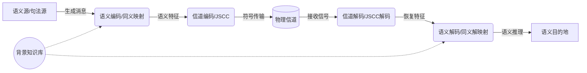

# Agent Eval Report 20260824-201724

agent: fcae0115-ea0f-4c86-b688-56ac9c88db05 / 1787573592202

## diagram — PASS (92.1s)

| check | result |
|---|---|
| answer_present | ✅ |
| no_flow_error | ✅ |
| markers_in_refs | ✅ |
| validation_clean | ✅ |
| grounded | ✅ |
| refused | ✅ |
| no_task_failure | ✅ |
| has_mermaid | ✅ |

回答片段：

语义通信系统的架构通常包含语义处理层与传输层，其核心目标是从信源提取语义特征并准确传递，而非仅关注符号级的比特无误传输【I】。系统主要由以下核心模块构成【II】：
- **语义源与句法源**：语义源产生原始语义信息，并驱动句法源生成具体的消息序列【III】。
- **语义编码/同义映射**：利用深度学习等模型从原始消息中提取对下游任务有用的语义特征，并将其映射为紧凑的语义表示【IV】。
- **信道编码/JSCC**：将语义特征映射为适合物理信道传输的符号序列，采用联合信源信道编码技术以提升传输效率【IV】。
- **物理信道**：传输编码符号，过程中会引入物理损伤（如噪声、衰落）以及可能导致误解的语义噪声【V】。
- **信道解码与语义解码**：接收端从含噪信号中恢复特征符号，并通过同义解映射结合背景知识进行语义推理与重构【VI】。
- **语义目的地**：利用重构的语义信息执行特定的智能任务或完成信息理解【V】。

该系统设计突破了传统通信仅优化收发传输模块的局限，实现了从信源信息到最终应用任务目标的整体信息处理块联合优化【VII】。
----

 I. 传统与语义通信系统对比及核心优化目标
 II. 语义通信系统主要组件概述
 III. 语义源、句法源与同义映射的工作机制
 IV. 语义编码

---

## 汇总：ALL PASS
