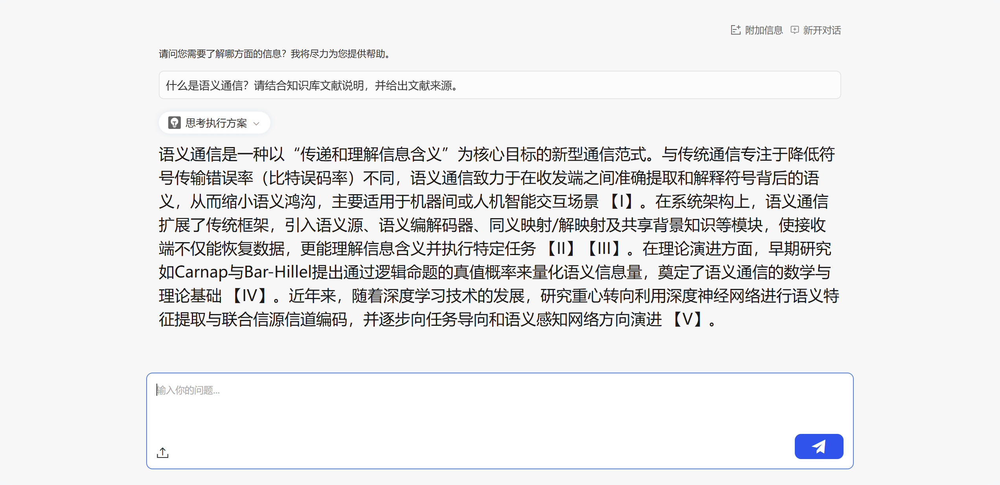

# 语义通信助手 · 演示问答结果

## 在线体验链接（B 路线 · 语义通信知识问答）

分享链接（v1.4，含引用校验节点；shareUuid `22ddb3160f3e4847ba90f7b5c4f8fb60`，已启用）：

```
http://10.128.203.200:30226/agent/index.html#/arrange/agentExp?randomCode=22ddb3160f3e4847ba90f7b5c4f8fb60&noLayout=1
```

> 旧链接（shareUuid `d1e2c75974744be5acceda575766a8bc`）指向已下线的 v1.0，不再使用。

平台实际运行截图（2026-08-23，问题：什么是语义通信？请结合知识库文献说明，并给出文献来源。）：



## 脚本化批量问答结果（scripts/run_demo_qa.py）

| # | 状态 | 用时 | 问题 | 结果文件 |
|---|---|---|---|---|
| 1 | OK | 92s | 什么是语义通信？它和传统通信有什么区别？ | [qa_01_什么是语义通信-它和传统通信有什么区别.md](qa_01_什么是语义通信-它和传统通信有什么区别.md) |
| 2 | OK | 143s | Deep JSCC 的核心思想是什么？它是如何工作的？ | [qa_02_Deep-JSCC-的核心思想是什么-它是如何工作的.md](qa_02_Deep-JSCC-的核心思想是什么-它是如何工作的.md) |
| 3 | OK | 114s | Deep JSCC 和 DeepSC 有什么区别？ | [qa_03_Deep-JSCC-和-DeepSC-有什么区别.md](qa_03_Deep-JSCC-和-DeepSC-有什么区别.md) |
| 4 | OK | 102s | 语义通信目前面临哪些主要挑战？ | [qa_04_语义通信目前面临哪些主要挑战.md](qa_04_语义通信目前面临哪些主要挑战.md) |
| 5 | OK | 92s | 什么是任务导向通信（task-oriented communication）？和经典通信范式有什么不同？ | [qa_05_什么是任务导向通信-task-oriented-comm.md](qa_05_什么是任务导向通信-task-oriented-comm.md) |
| 6 | OK | 114s | SNR 自适应的深度联合信源信道编码是如何实现的？ | [qa_06_SNR-自适应的深度联合信源信道编码是如何实现的.md](qa_06_SNR-自适应的深度联合信源信道编码是如何实现的.md) |
