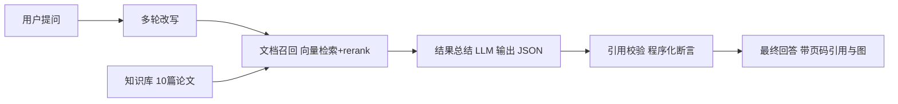

# 语义通信助手

## 项目策划书与设计方案

东南大学 AI+ 创新应用大赛 · 赛道一 · AI Agent 应用创新赛

版本 v1.6 | 2026-08-26 | 团队 孙浩（东南大学）

---

## 执行摘要

一句话说清这个项目。我们做了一个面向语义通信领域的文献问答智能体。它基于 10 篇核心论文的全文知识库回答问题，每条引用都能追溯到原文页码，引用真实性由程序校验，而不是交给模型自觉。架构和流程类问题会额外输出一张 mermaid 图，平台界面直接渲染成 SVG。

交付状态。B 路线工作流已发布上线，版本 v1.6。知识库 10 篇论文全部解析成功，状态 200。确定性评测 4 场景全绿，校验节点单测 6/6 通过。线上分享链接可直接体验。Demo 视频在 8/31 截止前补齐。

技术深度落在哪。评分权重里 30% 的创新性看 RAG 与 Function Calling 的应用深度。Function Calling 在当前平台被后端沙箱故障挡住，下文风险节有两次实测证据。我们把深度押在 RAG 的可靠性上。回答经过三级引用校验。正文标记、引用列表、召回 chunk 三方一致，未通过的引用会显式标注，错误不被掩盖。

## 一、问题与背景

科研场景里读论文有三个具体痛点，每个都来自实际使用过程。

找文献难。语义通信方向从 Deep JSCC 到任务导向通信，子方向多，关键词乱，新手不知道从哪篇经典论文入手。

读文献难。论文概念密集，互相引用，读一篇要回溯好几篇，缺少一条按主题渐进的主线。

引用可信度难验证。通用大模型问答不区分领域，不给文献来源。回答里的陈述没法回原文核对，科研场景不敢直接用。

这三个痛点落在同一个判断上。科研问答的可靠性来自可溯源的检索和程序化的引用校验，模型只负责理解和组织。整个系统按这个判断搭建。

## 二、方案总览

系统部署在东南大学指定的 OpenTrek 平台（百炼系），双形态交付。

B 路线是确定性工作流，主推。11 个节点 10 条边，从问题改写、文档召回、结果总结到引用校验，链路固定，结果可复现。适合知识问答。

A 路线是角色对话自主 Agent，备选。AutoBotV2 加 ReAct 引擎，角色化对话与自主规划。工具已预注册，执行器受平台沙箱限制。

## 三、技术方案细节

### 3.1 领域知识库

10 篇论文覆盖三档。奠基档是 DeepSC、Deep JSCC、语义通信综述、语义通信理论。扩展档是视频与文本语义通信、SNR 自适应 JSCC、语义重要性 JSCC。理论档是语义通信数学理论。

每篇论文全文明文解析，切成 chunk 并向量化。每个 chunk 带 file_code、页码和版面坐标。这是引用能溯源到页的数据基础。

灌库整条流程 API 化。STS 临时凭证、minio 预签名 PUT、注册解析，一条脚本跑完。后续扩方向到泛 CS 文献可以批量灌库。

### 3.2 RAG 管线

流程是 开始、多轮改写、文档召回、召回结果处理、选择器、总结参数、结果总结、meta 校验、文本组合、内容输出。

多轮改写结合会话历史，把追问补全成独立问题，再驱动检索。文档召回是向量检索加 rerank。结果总结按 JSON Schema 输出 answer 和 refs 两部分，refs 的 idx 必须对应召回内容。

### 3.3 引用三级校验，核心创新

meta 节点是脚本节点，跑程序化校验，做三件事。

第一，容错解析结果总结的 JSON。LLM 可能给 markdown 围栏、残缺 JSON，解析器去围栏、截取首个 JSON 对象再解析。

第二，断言每个引用 idx 真实存在于本次召回 chunk。模型引用了不在召回里的内容，立刻标记。

第三，断言正文每个【X】标记都有对应 refs 条目。标记和引用列表对不上，立刻标记。

未通过校验的引用会输出一行警告，注明是哪条引用没能核实。这套逻辑有 6 个单测，覆盖伪造引用、缺失标记、非法 JSON、markdown 围栏等负路径，全部通过。

### 3.4 mermaid 图表输出

架构和流程类问题会在回答末尾附一段 mermaid 代码块，平台聊天界面原生渲染成 SVG。实测聊天区出现 class 为 flowchart 的 SVG，页面里的 mermaid 源码块被渲染器消费。平台没有原生生图模型，这条路用文本渲染补上了可视化短板。

### 3.5 双引擎

A 路线是角色对话 Agent，引擎 AutoBotV2 加 ReAct，模型 qwen3.6-plus。它具备自主规划、任务拆解和总结能力。工具（联网搜索 MCP、数学计算器）已注册到 Agent 上。平台工具执行沙箱后端故障，两次实测分别在联网搜索上报 AGENT_TASK_DEFAULT_FAILED，在计算器上报 taskBeforeConfig is null。平台修复后可以闭合思考、动作、观察循环。

## 四、工程与质量保障

### 4.1 确定性评测

eval 套件跑 4 个场景。概念问答、多步递进提问、联网越界、mermaid 图表。每个场景断言回答存在、无流程错误、引用与 refs 一致、校验干净、拒绝编造、无任务失败。

实测数据来自 2026-08-26 的运行记录。概念问答 102.9 秒，多步递进 164.8 秒，联网越界 112.3 秒，mermaid 图表 122.6 秒，4/4 全绿。

### 4.2 对抗探针

多步任务探针验证一个问题是否真的被拆解执行。联网越界探针验证 Agent 会不会编造。跨轮追问探针验证会话上下文复用。原始记录都在仓库 demo/probes 目录。

### 4.3 发布纪律与凭据安全

平台 ONLINE 配置冻结，每次修改必须克隆新版本再发布。deploy_flow.py 把克隆、补丁、保存、上线串成一条命令。版本从 v1.0 迭代到 v1.6，每个版本有明确改动记录。

凭据只从环境变量或本地 .env 读取，不落仓库。.env 已被 gitignore，仓库提供 .env.example 模板。

## 五、平台约束与应对

以下是实测过的约束，不是猜测。每条都有对应应对。

工具执行沙箱后端故障。工具能注册，运行时后端崩溃。应对是主推 B 路线知识库问答，A 路线展示自主规划与引擎就绪。

脚本沙箱禁网。流程内只支持 re、json、string、math 等白名单模块，不能调外部 API。应对是检索全部收敛到平台知识库节点。

无原生生图模型。模型类型表里没有 IMAGE_GENERATION。应对是 mermaid 文本渲染成 SVG。

ONLINE 配置冻结。应对是克隆新版本发布，已自动化。

知识库解析失败曾经出现。根因是源 PDF 损坏，不是解析模型问题。换成有效版本后 API 补传，10/10 解析成功。

## 六、实施计划与里程碑

8/19 选题调研，arXiv 文献核验。8/21 平台资产初始化，知识库首批上传。8/22 A 路线角色对话 Agent 验证。8/23 B 路线流程修复与端到端验证，4 篇损坏 PDF 补传。8/24 GAN 对抗自审，引用校验节点上线，确定性评测全绿，P0 凭据安全与发布自动化。8/26 提交前核查，README 补充，本策划书定稿。8/31 前 Demo 视频录制与最终提交。

## 七、演示方案

6 个演示问题全部真实跑通。什么是语义通信，Deep JSCC 核心思想，Deep JSCC 与 DeepSC 区别，语义通信主要挑战，任务导向通信，SNR 自适应 JSCC。加一个 mermaid 架构图问题。

视频节奏是打开分享链接、依次提问、展示检索、总结、引用校验的完整流程，再展示联网越界时明确拒绝而不是编造。

## 八、创新点与评分对照

应用创新性 30%。引用三级校验加页码溯源加可复现评测体系，这是 RAG 应用深度的实打实证据。

技术实现质量 30%。确定性工作流架构、eval、探针、单测、发布自动化、凭据安全，仓库里都有代码和报告。

应用效果与体验 20%。6 题演示全通，分享链接即开即用，引用可回原文核对。

文档完整性 20%。本策划书、技术报告、Demo 视频三件套。

## 九、风险与应对

| 风险 | 影响 | 应对 |
|---|---|---|
| 工具执行沙箱后端故障 | A 路线无法实时检索，Function Calling 深度受限 | 主推 B 路线知识库问答，策划书如实披露 |
| 脚本沙箱禁网 | 流程内不能调外部 API | 检索收敛到平台知识库节点 |
| 无原生生图模型 | 多模态展示受限 | mermaid 文本渲染成 SVG |
| 设计页二次访问白屏 | 改配置困难 | 配置完成后不再进入设计页，改动走克隆新版本 |
| 论文解析失败 | 召回覆盖下降 | 根因是源 PDF 损坏，有效版本 API 补传成功 |
| 会话凭据过期 | 自动化脚本中断 | 凭据入 .env，过期从浏览器刷新，脚本对 401 快速失败 |

## 十、团队与分工

单人开发。Codex 与浏览器自动化辅助完成平台操作、流程调试、知识库维护、评测脚本化。Codex 负责代码与文档工程化，人在关键决策点把关。
